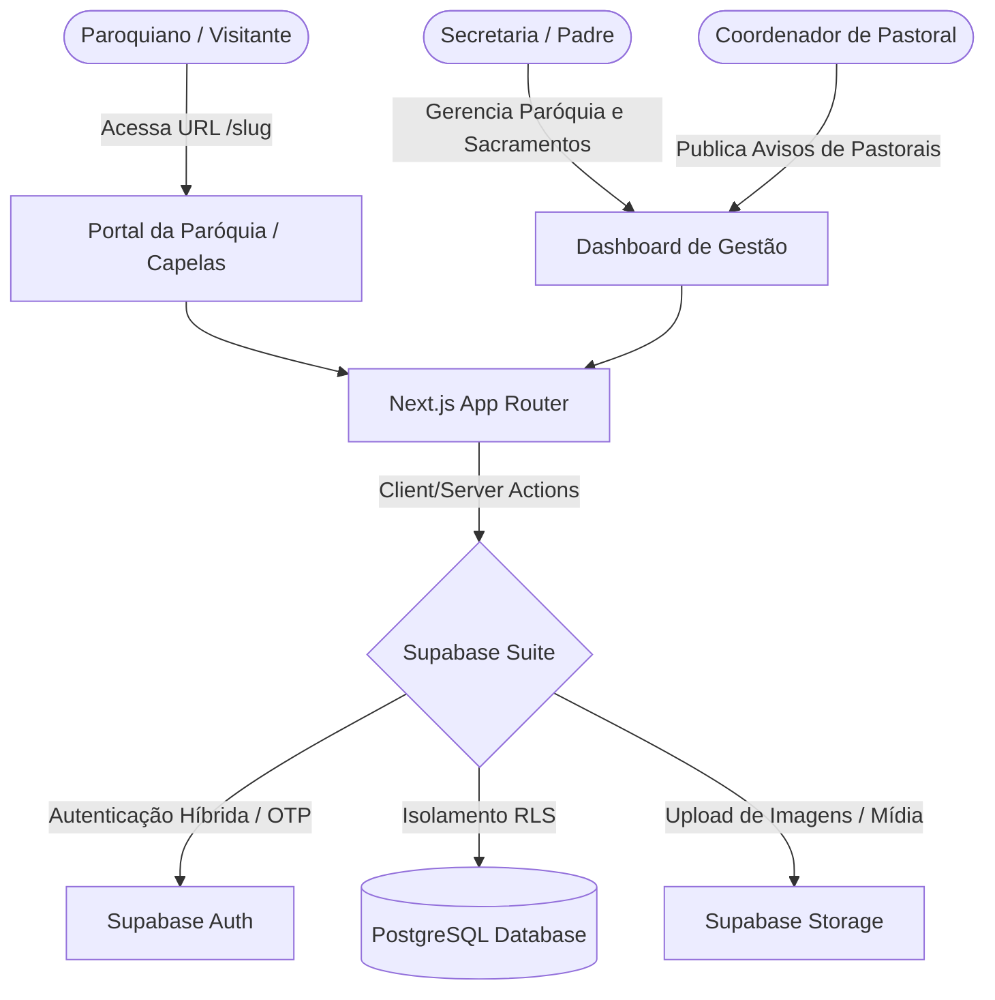

# Especificação Arquitetural: Rede Social para Paróquias (Modelo Multi-tenant)

Este documento reúne toda a arquitetura, estrutura de banco de dados e padrões de desenvolvimento do aplicativo **PlataformaCard** adaptados e mapeados para a criação do projeto **"Casa Digital" (Presença Digital e Evangelização)** para paróquias, utilizando como base a proposta da **Catedral de Colatina (Paróquia Sagrado Coração de Jesus)**.

O objetivo é acelerar o desenvolvimento reutilizando a mesma fundação técnica (Next.js + Supabase + Tailwind CSS) sem iniciar o código do zero.

---

## 🏛️ 1. Visão Geral da Arquitetura

O sistema operará sob um modelo **Multi-tenant SaaS** com uma camada secundária de **sub-tenancy** para acomodar as comunidades filiadas:
- **Tenant Principal (Locatário/Faturamento):** Paróquia (`Parish`). A paróquia gerencia a assinatura.
- **Sub-tenants (Capelas/Comunidades Filiadas):** Comunidades (`Communities`). Cada capela/comunidade da paróquia ganha seu perfil, agenda de celebrações e avisos próprios, todos centralizados sob o portal da Paróquia.
- **Acesso Público/Fiéis:** Um endereço amigável na web (ex: `casadigital.com.br/[slug-da-paroquia]`) onde os paroquianos acessam o portal de avisos, horários e dízimo.
- **Painel Administrativo:** Acessado por administradores da paróquia (secretaria) e coordenadores de pastorais para gerenciar o conteúdo e solicitações de sacramentos.



---

## 🗄️ 2. Modelagem do Banco de Dados (PostgreSQL + Supabase)

Estrutura de tabelas mapeada para suportar a integração de comunidades, secretaria e doações:

### A. Tabela: `parishes` (Tenants)
Centraliza os dados cadastrais, modelo de dízimo e faturamento da paróquia.
```sql
CREATE TABLE parishes (
  id UUID PRIMARY KEY DEFAULT gen_random_uuid(),
  name TEXT NOT NULL,
  slug TEXT UNIQUE NOT NULL, -- ex: 'catedral-colatina' -> /catedral-colatina
  address TEXT,
  phone TEXT, -- Contato da secretaria
  logo_url TEXT,
  banner_url TEXT,
  live_stream_url TEXT, -- Link ativo de transmissão (ex: Youtube Live)
  social_links JSONB DEFAULT '{}'::jsonb, -- Instagram, Facebook, Youtube
  plan_type TEXT DEFAULT 'free', -- 'free', 'premium'
  status TEXT DEFAULT 'active',
  created_at TIMESTAMP WITH TIME ZONE DEFAULT timezone('utc'::text, now()) NOT NULL,
  updated_at TIMESTAMP WITH TIME ZONE DEFAULT timezone('utc'::text, now()) NOT NULL
);
```

### B. Tabela: `communities` (Sub-tenants / Capelas)
Mapeia as capelas e comunidades vinculadas à paróquia central (Igreja Matriz).
```sql
CREATE TABLE communities (
  id UUID PRIMARY KEY DEFAULT gen_random_uuid(),
  parish_id UUID REFERENCES parishes(id) ON DELETE CASCADE NOT NULL,
  name TEXT NOT NULL, -- ex: 'Capela Santo Antônio'
  slug TEXT UNIQUE NOT NULL,
  address TEXT,
  logo_url TEXT,
  created_at TIMESTAMP WITH TIME ZONE DEFAULT timezone('utc'::text, now()) NOT NULL
);
```

### C. Tabela: `profiles` (Usuários & Papéis)
```sql
CREATE TABLE profiles (
  id UUID REFERENCES auth.users ON DELETE CASCADE PRIMARY KEY,
  name TEXT NOT NULL,
  email TEXT UNIQUE,
  phone TEXT,
  avatar_url TEXT,
  role TEXT DEFAULT 'parishioner', -- 'super_admin', 'parish_admin', 'pastoral_coordinator', 'parishioner'
  parish_id UUID REFERENCES parishes(id) ON DELETE SET NULL,
  community_id UUID REFERENCES communities(id) ON DELETE SET NULL, -- Caso o usuário frequente uma capela específica
  created_at TIMESTAMP WITH TIME ZONE DEFAULT timezone('utc'::text, now()) NOT NULL
);
```

### D. Tabela: `posts` (Mural de Notícias, Missas e Avisos)
Unifica avisos, horários de missas e reuniões de pastorais.
```sql
CREATE TABLE posts (
  id UUID PRIMARY KEY DEFAULT gen_random_uuid(),
  parish_id UUID REFERENCES parishes(id) ON DELETE CASCADE NOT NULL,
  community_id UUID REFERENCES communities(id) ON DELETE CASCADE, -- Se NULL, pertence à Igreja Matriz
  author_id UUID REFERENCES profiles(id) ON DELETE SET NULL,
  title TEXT NOT NULL,
  description TEXT, -- Rich Text (HTML)
  image_url TEXT,
  type TEXT NOT NULL DEFAULT 'notice', -- 'notice' (aviso geral), 'mass_schedule' (horário de missa/confissão), 'pastoral_meeting' (reunião)
  
  -- Campos específicos para Celebrações / Reuniões
  event_date TIMESTAMP WITH TIME ZONE,
  location TEXT,
  
  status TEXT DEFAULT 'published', -- 'published', 'draft', 'archived'
  created_at TIMESTAMP WITH TIME ZONE DEFAULT timezone('utc'::text, now()) NOT NULL,
  updated_at TIMESTAMP WITH TIME ZONE DEFAULT timezone('utc'::text, now()) NOT NULL
);
```

### E. Tabela: `sacrament_requests` (Central de Atendimento / Secretaria)
Mapeia solicitações de sacramentos ou agendamentos diretamente dos fiéis para a equipe administrativa.
```sql
CREATE TABLE sacrament_requests (
  id UUID PRIMARY KEY DEFAULT gen_random_uuid(),
  parish_id UUID REFERENCES parishes(id) ON DELETE CASCADE NOT NULL,
  requester_id UUID REFERENCES profiles(id) ON DELETE SET NULL,
  sacrament_type TEXT NOT NULL, -- 'baptism' (Batismo), 'wedding' (Casamento), 'confirmation' (Crisma)
  requester_name TEXT NOT NULL,
  requester_phone TEXT NOT NULL,
  details JSONB DEFAULT '{}'::jsonb, -- Nomes dos noivos, padrinhos, datas pretendidas
  status TEXT DEFAULT 'pending', -- 'pending', 'analyzing', 'scheduled', 'cancelled'
  notes TEXT, -- Observações internas da secretaria
  created_at TIMESTAMP WITH TIME ZONE DEFAULT timezone('utc'::text, now()) NOT NULL,
  updated_at TIMESTAMP WITH TIME ZONE DEFAULT timezone('utc'::text, now()) NOT NULL
);
```

### F. Tabela: `mass_intentions` (Intenções de Missa)
Fiéis solicitam intenções de missa (ação de graças, falecimento, saúde).
```sql
CREATE TABLE mass_intentions (
  id UUID PRIMARY KEY DEFAULT gen_random_uuid(),
  parish_id UUID REFERENCES parishes(id) ON DELETE CASCADE NOT NULL,
  community_id UUID REFERENCES communities(id) ON DELETE CASCADE,
  requester_name TEXT NOT NULL,
  intention_for TEXT NOT NULL, -- Nome de quem recebe a intenção
  intention_type TEXT NOT NULL DEFAULT 'thanksgiving', -- 'deceased' (falecimento), 'health' (saúde), 'thanksgiving' (ação de graças)
  target_date DATE NOT NULL, -- Dia em que deseja que a intenção seja lida
  status TEXT DEFAULT 'pending', -- 'pending', 'approved', 'read'
  created_at TIMESTAMP WITH TIME ZONE DEFAULT timezone('utc'::text, now()) NOT NULL
);
```

---

## 🔒 3. Políticas de RLS (Row Level Security)

Segurança no banco de dados para garantir privacidade dos dados dos fiéis e isolamento entre as paróquias:

```sql
-- Habilitar RLS
ALTER TABLE communities ENABLE ROW LEVEL SECURITY;
ALTER TABLE sacrament_requests ENABLE ROW LEVEL SECURITY;
ALTER TABLE mass_intentions ENABLE ROW LEVEL SECURITY;

-- Políticas para Sacramentos (Fiéis veem apenas suas solicitações, Secretaria vê tudo da Paróquia)
CREATE POLICY "Users read own sacrament requests" 
ON sacrament_requests FOR SELECT 
TO authenticated 
USING (requester_id = auth.uid());

CREATE POLICY "Secretariat manages parish sacrament requests" 
ON sacrament_requests FOR ALL 
TO authenticated 
USING (
  EXISTS (
    SELECT 1 FROM profiles 
    WHERE profiles.id = auth.uid() 
      AND profiles.role = 'parish_admin' 
      AND profiles.parish_id = sacrament_requests.parish_id
  )
);
```

---

## 📈 4. Estratégia de Evolução do Produto baseada no Escopo Oficial

Para alinhar o desenvolvimento com as necessidades expostas na proposta da Catedral de Colatina, organizamos as entregas nas seguintes fases:

### 🚀 Fase 1: Mural Digital, Missas & Atendimentos (MVP)
*   **Vitrine da Paróquia:** Portal público responsivo (PWA) listando os horários de missa em tempo real e o Mural de Notícias.
*   **Integração de Capelas:** Filtro na vitrine que permite ao fiel selecionar a capela/comunidade filial específica para ver horários de missas e avisos daquela comunidade.
*   **Secretaria Digital (Leads Administrativos):**
    *   Formulário simplificado para o fiel solicitar **Intenções de Missa** diretamente no portal.
    *   Formulário de **Pedidos de Sacramentos** (Batismo, Crisma, Casamento) que cai direto no dashboard da secretaria.
    *   Link de contato direto via WhatsApp da secretaria.
*   **Transmissões ao Vivo:** Widget de vídeo (Youtube Live) destacado no portal em horários de celebração.

### 👥 Fase 2: Pastorais & Interatividade
*   **Acesso de Pastorais:** Coordenadores de pastorais ganham login no sistema com a permissão `pastoral_coordinator`, podendo atualizar o cronograma de reuniões e avisos específicos de seu grupo.
*   **Notificações Semanais:** Envio de e-mail ou push com os principais avisos de domingo.

### ⛪ Fase 3: Dízimo e Ofertas (Abordagem Litúrgica)
*   **Dízimo Digital:** Espaço para devolução do dízimo e ofertas via PIX ou cartão de crédito.
*   **Experiência Humanizada:** Em vez de telas frias de faturamento ("pagar boleto"), a interface é desenhada sob uma perspectiva litúrgica de agradecimento e partilha, gerando mensagens e cartões digitais de gratidão automática para os dízimos devolvidos.

---

## 🪙 5. Modelo SaaS (Plano Grátis vs. Premium)

| Recursos / Limites | Plano Grátis (Essential) | Plano Premium (Pro/Paroquial) |
| :--- | :--- | :--- |
| **Comunidades/Capelas** | Igreja Matriz + até 2 capelas | Capelas e comunidades ilimitadas |
| **Administradores** | 1 administrador geral | Administradores + coordenadores ilimitados |
| **Central de Atendimento** | Apenas botão de WhatsApp | Sistema de solicitação de sacramentos e intenções integrado no painel |
| **Dízimo Digital** | Link Pix simples | Integração de Pix Dinâmico e Cartão com histórico de contribuições |
| **Storage de Imagens** | 100 MB | 5 GB |
