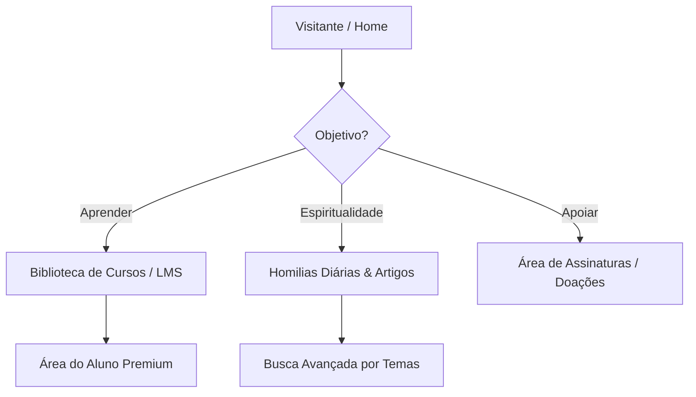

# Referências de Design e Usabilidade para Portais Católicos

Este documento compila a pesquisa de referências de design e usabilidade de sites católicos de alta relevância, com foco especial no portal **Padre Paulo Ricardo**, estruturando aprendizados e sugestões aplicáveis ao desenvolvimento da **Casa Digital Paroquial** da Catedral de Colatina.

---

## 1. Estudo de Caso: padrepauloricardo.org

O site do Padre Paulo Ricardo é uma das maiores referências de presença digital católica no Brasil. Embora seu objetivo principal seja a formação acadêmica e teológica (LMS), sua estrutura e identidade visual trazem valiosos ensinamentos de *branding* e arquitetura da informação.



### Análise de Design & UX (User Experience)

| Aspecto | Detalhes da Implementação | Aplicação no Projeto Colatina |
| :--- | :--- | :--- |
| **Identidade Visual e Branding** | Uso de tipografia serifada e sóbria que reflete a tradição e autoridade da Igreja. Paleta de cores fechada (tons escuros e dourado), criando um clima solene e de estudo acadêmico. | Adotar tipografia clássica (ex: *Playfair Display*) combinada com sans-serif legível (*Inter*) para equilibrar tradição e modernidade. |
| **Arquitetura da Informação** | Distribuição hierárquica clara. O conteúdo é focado em categorias temáticas (Mariologia, Teologia, Sagradas Escrituras), permitindo tanto a navegação livre quanto o aprendizado guiado. | Separar os sacramentos, avisos pastorais e horários de missa em seções evidentes e fáceis de filtrar por capela/comunidade. |
| **Foco em Conversão (Apoio)** | Área de "Minha Conta" e fluxos de assinatura muito claros, mas com comunicação respeitosa e integrada ao ecossistema de aprendizado. | Desenvolver a seção do **Dízimo** focando na partilha comunitária e no acolhimento, usando botões e copys humanizados. |
| **Responsividade & App** | Excelente adaptação para dispositivos móveis, com leitura fluida e um aplicativo dedicado que espelha os conteúdos. | Priorizar a abordagem *mobile-first* (PWA) para que os paroquianos idosos ou em movimento acessem tudo facilmente. |

---

## 2. Portais e Sites de Destaque no Brasil e no Mundo

Para complementar as referências, analisamos outros grandes portais católicos sob a ótica de interface e experiência de usuário:

````carousel
### Vatican News
*   **Foco**: Noticioso e institucional.
*   **Força de Design**: Layout limpo, alta legibilidade, multi-idioma nativo. Destaque para transmissões de vídeo e áudio em tempo real (Rádio Vaticano).
*   **Aprendizado**: O uso de espaços em branco (padding generoso) e o contraste de cores facilitam o consumo de textos longos.
<!-- slide -->
### Portal A12 (Santuário Nacional)
*   **Foco**: Multiplataforma (TV, Rádio, Notícias e Devoção).
*   **Força de Design**: Design vibrante, focado em imagens reais da devoção mariana. Botões gigantes para doação e velas virtuais.
*   **Aprendizado**: Integração de serviços populares e interativos que criam um senso de participação, mesmo à distância.
<!-- slide -->
### Canção Nova (cancaonova.com)
*   **Foco**: Evangelização midiática, eventos e transmissões ao vivo.
*   **Força de Design**: Centralização das transmissões da TV e Rádio na Home. Links rápidos para liturgia diária e clube de contribuintes.
*   **Aprendizado**: Facilitar o acesso ao player ao vivo no topo da página é fundamental para engajar o público idoso e acamado.
<!-- slide -->
### St. Matthew Catholic Church (Referência EUA)
*   **Foco**: Paroquial e comunitário de excelência.
*   **Força de Design**: Minimalismo elegante, uso de vídeos na dobra principal (hero section) mostrando a comunidade e arquitetura local.
*   **Aprendizado**: O "Horário das Missas" é a primeira coisa que o usuário vê (acesso em menos de 3 segundos).
````

---

## 3. Diretrizes de Design para a Casa Digital (Catedral de Colatina)

Com base nas referências estudadas e no arquivo [globals.css](file:///Users/macstudio-maj/AppData/Local/Gemini/antigravity/worktrees/EcclesiamApp/research-catholic-design-sites/app/globals.css), propomos as seguintes diretrizes para o design da nossa plataforma:

### A. Integração de Cores Litúrgicas Dinâmicas
O site deve respirar a liturgia da Igreja Católica. Através dos seletores CSS que já temos no sistema, a interface (barras de navegação, botões primários e detalhes de cards) deve mudar dinamicamente conforme o tempo litúrgico:
*   🟢 **Tempo Comum**: Verde oliva (`--liturgy-green`) - transmite esperança e crescimento espiritual.
*   🟣 **Advento / Quaresma**: Roxo sóbrio (`--liturgy-purple`) - transmite penitência e preparação.
*   🟡 **Páscoa / Natal / Solenidades**: Dourado litúrgico (`--liturgy-gold`) - transmite glória, luz e realeza.
*   🔴 **Pentecostes / Mártires**: Vermelho vivo (`--liturgy-red`) - fogo do Espírito Santo e martírio.

> [!TIP]
> A cor litúrgica deve ser aplicada de forma elegante (micro-detalhes, bordas, links) para não sobrecarregar visualmente a interface e manter o alto contraste.

### B. Acessibilidade de Alto Contraste (Foco na Terceira Idade)
Grande parte do público fiel da Catedral é composta por pessoas idosas. O design deve refletir essa necessidade de forma nativa:
*   **Tipografia**: Uso de fontes com boa altura-x (como *Inter* para textos de suporte e *Playfair Display* para títulos solenes). Texto corrido com no mínimo `16px` no mobile.
*   **Contraste**: Manter a conformidade com as diretrizes WCAG AA (contraste mínimo de 4.5:1 para texto normal).
*   **Touch Targets**: Botões de ação (como falar no WhatsApp da Secretaria ou Agendar Sacramentos) devem ter uma área de toque mínima de `48px x 48px`.

### C. Estrutura Recomendada para a Home da Paróquia
1.  **Dobra Principal (Hero)**: Vídeo ou imagem em altíssima qualidade da fachada ou do interior da Catedral de Colatina, com os **Horários da Próxima Missa** destacados em um card flutuante (*Glassmorphism*).
2.  **Avisos Rápidos e Mural**: Um feed limpo e dinâmico de notícias e comunicados do Padre Irineu Claudino Sales.
3.  **Acesso aos Sacramentos**: Um grid minimalista com ícones elegantes para guiar o usuário nos processos de *Batismo*, *Crisma*, *Matrimônio* e *Unção dos Enfermos*.
4.  **Dízimo e Partilha**: Um banner institucional focado na gratidão e na beleza da partilha, com acesso rápido para contribuição PIX ou cartão de forma segura.
5.  **Comunidades Filiais**: Seção para filtrar as capelas e seus respectivos horários e padroeiros.

---

## 4. Próximos Passos Recomendados

Para materializarmos essas referências no código do Next.js:
1.  **Validar a Paleta Litúrgica**: Testar a aplicação das cores litúrgicas no layout da página pública (`[slug]/page.tsx`).
2.  **Prototipar a Home da Paróquia**: Criar o layout da Home pública utilizando Tailwind v4, respeitando as classes utilitárias e de Glassmorphism já declaradas no CSS.
3.  **Desenvolver o Seletor de Tempo Litúrgico**: Implementar um controle simples no Dashboard ou via data atual para testar a reatividade de cores do site.
